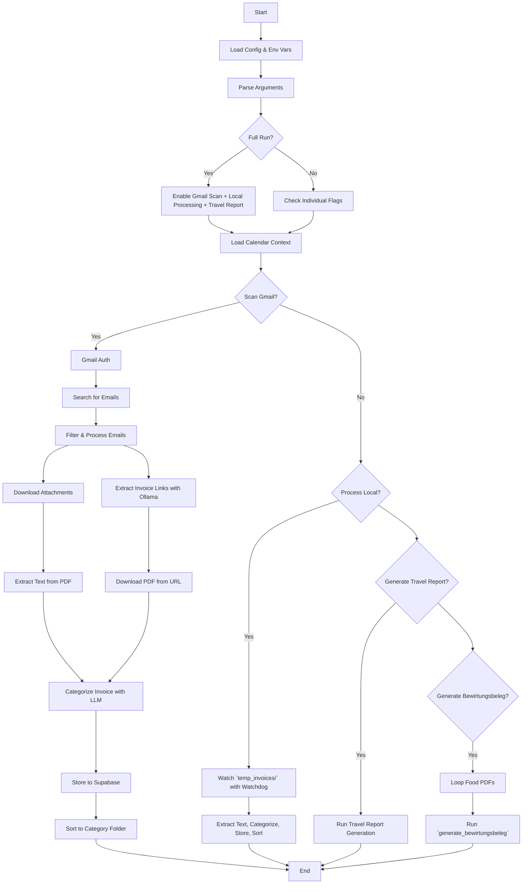

# Why this script? - Gmail Invoice Sorting


I didn't want to download and sort all my emails manually for the yearly invoicing, so I wrote an LLM bot script to do it for me. 

Automatically fetch, categorize, rename and sort invoices from Gmail or local folders using a local LLM (via Ollama) or ChatGPT (via OpenAI API).

Generate Excel travel reports summarizing travel-related expenses (trips and meals) for a given year. The output supports both English and German column headers.

## Installing 
Install dependencies into a venv with UV. Make sure to have UV installed.
```bash
uv sync
```
Then enable the venv.

Make sure to download your Gmail OAuth 2.0 Credentials Json from your Google Cloud Console after enabling the Gmail API. This has to be placed in the `credentials.json` file.

## Running

```bash
python main.py --scan-gmail
```
Scans Gmail and processes invoices found in emails.

```bash
python main.py --process-local
```
Processes and sorts local PDFs dropped into `temp_invoices/`.

```bash
python main.py --generate-travel-report 2024 --lang en
```
Generates a travel expense report for the given year with **English** column headers.

```bash
python main.py --generate-travel-report 2024 --lang de
```
Generates the same report with **German** column headers.

```bash
python main.py --generate-travel-report 2024 --lang en --use-cache --parallel
```
Enables caching of LLM results and multi-threaded processing to speed up report generation.

```bash
python main.py --generate-bewirtungsbeleg --use-llm-for-beleg
```
Prompts you to generate a Bewirtungsbeleg for each invoice in the `Invoices/Food/` folder, with fields automatically suggested by an LLM (ChatGPT or Ollama) and confirmed by you in the terminal.

### Optional Flags

- `--use-cache`: Saves LLM responses to disk and reuses them to avoid duplicate API or model calls.
- `--parallel`: Uses multi-threading to process invoices faster (especially helpful for many PDFs).
- `--generate-bewirtungsbeleg`: Interactively create Bewirtungsbelege for restaurant/meal invoices.
 - `--use-llm-for-beleg`: Use an LLM to autofill suggested values for Bewirtungsbeleg fields.

```bash
python main.py --full-run --calendar-context calendar.ics
```
Runs a full workflow: Gmail scan, local invoice processing, and travel report generation with optional calendar context.

```bash
python main.py --rename-by-date --calendar-context calendar.ics
```
Renames files using the first detected date and appends a calendar event keyword if matched.

## Calendar Context (optional)

You can provide one or more `.ics` calendar files using the `--calendar-context` flag to enrich file names based on your schedule.

Example:
```bash
python main.py --rename-by-date --calendar-context calendar.ics
```

This allows the script to include contextual slugs in filenames, like `2024-06-13-kickoff.pdf` or `2024-07-01-vacation.pdf`, based on events scheduled that day.

## Mermaid Diagram

