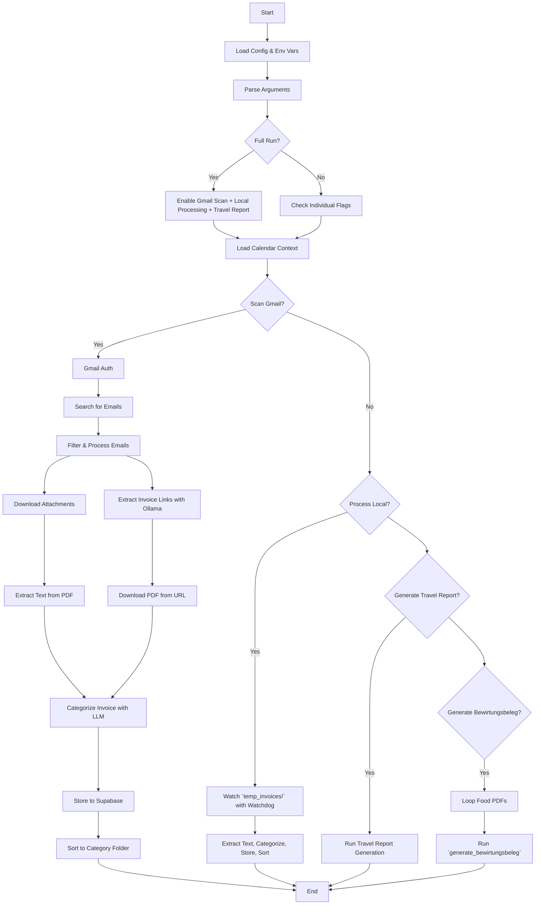

# Why this CLI script? - Gmail Invoice Sorting


I didn't want to download and sort all my emails manually for the yearly invoicing, so I wrote an LLM bot script to do it for me. 

Automatically fetch, categorize, rename and sort invoices from Gmail or local folders using a local LLM (via Ollama) or ChatGPT (via OpenAI API).

Generate Excel travel reports summarizing travel-related expenses (trips and meals) for a given year. The output supports both English and German column headers.

## Complimentary Streamlit App: Interactive Bewirtungsbeleg Generator


The project also includes a Streamlit interface for interactively generating and attaching Bewirtungsbelege (German hospitality receipts) to your restaurant or meal invoices.

**Features:**
- Upload a PDF invoice or select one from your sorted `Invoices/Bewirtung/` folder
- Preview the original invoice and the generated Bewirtungsbeleg side by side
- Use LLM-based extraction to prefill form fields, or enter/edit them manually
- Optionally upload a signature image to be included on the Bewirtungsbeleg
- Download the combined PDF (Bewirtungsbeleg + invoice) or mark as done
- Filter and sort your invoices by processing status and filename
- Edit or regenerate Bewirtungsbelege for any invoice at any time

**Use case:**
This app is designed for freelancers, business owners, or anyone in Germany who needs to attach a Bewirtungsbeleg to meal-related invoices for tax or accounting purposes. It streamlines the process, ensures all required fields are filled, and keeps your workflow organized and auditable.

---

## EÜR-Aligned Invoice Categories

Invoice categories are aligned to the **Anlage EÜR** (Einnahmenüberschussrechnung), the German tax form used by Freiberufler and small businesses to report income and expenses. Using EÜR line numbers as categories means invoices map directly to tax filing lines — no manual re-sorting at year-end.

| Category | EÜR Line | What goes here |
|----------|----------|----------------|
| **Fremdleistungen** | 27 | Subcontractor invoices, freelancers you paid |
| **Arbeitsmittel** | 28/29 | Computers, monitors, software licenses, office supplies |
| **Reisekosten** | 31 | Deutsche Bahn, flights, Uber/Bolt, hotels |
| **Bewirtung** | 32 | Business meals with clients (70% deductible) |
| **Raumkosten** | 34 | Rent, home office, coworking |
| **Versicherungen** | 35 | Berufshaftpflicht, business insurance |
| **Telekommunikation** | 37 | Phone, internet |
| **Übrige Betriebsausgaben** | 38 | SaaS, cloud hosting, domains, ads, memberships |
| **Nicht abzugsfähig** | — | Personal purchases, non-deductible items |

The LLM classifier prompt includes these categories with examples and German tax context, so the model assigns the correct EÜR line from the start.

If you're upgrading from the old ad-hoc categories (Work Equipment, Insurance, Travel, Food, Subscriptions, Not Deductible, Lifestyle, Other), run:

```bash
python3 main.py migrate-categories
```

This renames the `Invoices/` subdirectories, updates all category and file path references in the SQLite index, and merges any overlapping folders. After migrating, you can re-evaluate past invoices with the improved prompt:

```bash
python3 main.py reclassify --year 2024
```

---

## Installing
Install dependencies into a venv with UV. Make sure to have UV installed.
```bash
uv sync
```
Then enable the venv.

Make sure to download your Gmail OAuth 2.0 Credentials Json from your Google Cloud Console after enabling the Gmail API. This has to be placed in the `credentials.json` file.

## Running functions using the CLI

```bash
python3 main.py sync-gmail --window-months 18 --apply-labels
```
Scans Gmail, ingests invoice PDFs, updates the local SQLite index, and applies Gmail labels (`Invoices/Processed`, `Invoices/NeedsReview`, `Invoices/Duplicate`).

```bash
python3 main.py sync-gmail --since 2025/01/01 --apply-labels
```
Scans Gmail starting at a fixed date.

```bash
python3 main.py find --vendor bahn --year 2026
```
Searches indexed invoices quickly without manual folder/email scanning.

```bash
python3 main.py find --status needs_review --open-gmail-link
```
Lists review-needed invoices and prints Gmail deep links for quick open.

```bash
python3 main.py export-accountant --year 2026 --month 1
```
Creates a monthly accountant handoff package with:
- `Exports/2026/2026-01/2026-01-invoices.zip`
- `Exports/2026/2026-01/2026-01-manifest.csv`

```bash
python3 main.py process-local
```
Processes and sorts local PDFs dropped into `temp_invoices/`.

```bash
python3 main.py --generate-travel-report 2024 --lang en
```
Generates a travel expense report for the given year with **English** column headers.

```bash
python3 main.py --generate-travel-report 2024 --lang de
```
Generates the same report with **German** column headers.

```bash
python3 main.py --generate-travel-report 2024 --lang en --use-cache --parallel
```
Enables caching of LLM results and multi-threaded processing to speed up report generation.

```bash
python3 main.py --generate-bewirtungsbeleg --use-llm-for-beleg
```
Prompts you to generate a Bewirtungsbeleg for each invoice in the `Invoices/Bewirtung/` folder, with fields automatically suggested by an LLM (ChatGPT or Ollama) and confirmed by you in the terminal.

### Optional Flags

- `--use-cache`: Saves LLM responses to disk and reuses them to avoid duplicate API or model calls.
- `--parallel`: Uses multi-threading to process invoices faster (especially helpful for many PDFs).
- `--generate-bewirtungsbeleg`: Interactively create Bewirtungsbelege for restaurant/meal invoices.
- `--use-llm-for-beleg`: Use an LLM to autofill suggested values for Bewirtungsbeleg fields.

### New commands

- `sync-gmail`: Gmail-first ingestion with rolling time window or explicit since date.
- `find`: Query the local index by vendor/category/status/year/month/text.
- `export-accountant`: Build monthly ZIP + CSV accountant handoff packages.
- `reindex`: Rebuild the local index from `Invoices/` category folders.
- `migrate-categories`: One-time migration from old categories to EÜR-aligned names.
- `reclassify --year YYYY`: Re-run the LLM classifier on existing invoices (e.g. after a prompt update).
- `--no-apply-labels` (with `sync-gmail`): Keep Gmail untouched while still indexing locally.

```bash
python3 main.py --full-run
```
Runs a full workflow: Gmail sync, local invoice processing, and travel report generation for the current year.

## Mermaid Diagram


